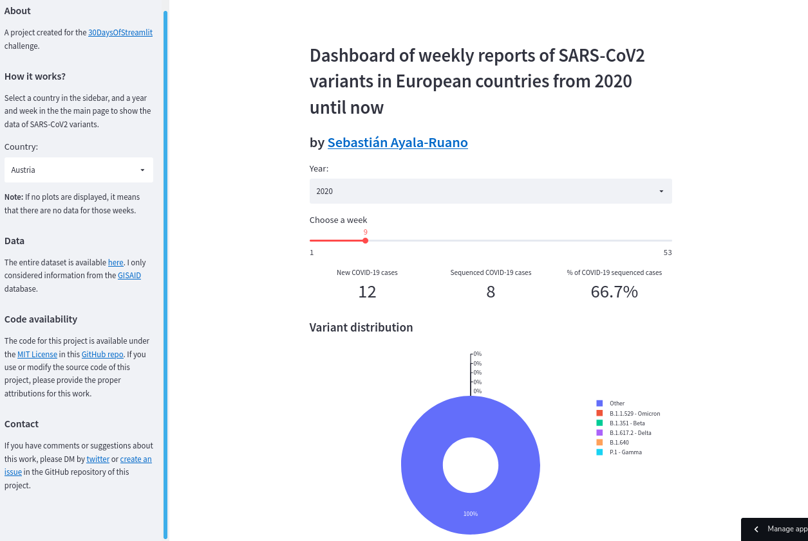

# Dashboard of weekly reports of SARS-CoV2 variants in European countries from 2020 until April 2022

## About the project

I created this dashboard for the [30DaysOfStreamlit](https://share.streamlit.io/streamlit/30days) challenge using the [streamlit](https://streamlit.io/) Python package.

The screen-shot bellow shows how this dashboard looks like: 

 

 

You can access the web application of this dashboard with this [link](https://share.streamlit.io/sayalaruano/dashboard_sars-cov2_variants_europe/main/st_dashboard_allcountries.py).

## Dataset 

The entire dataset is available [here](https://www.ecdc.europa.eu/en/publications-data/data-virus-variants-covid-19-eueea). I only considered information from the [GISAID](https://www.gisaid.org/) database.

## Contact 

If you have any comments or suggestions about this work, please DM by [twitter](https://twitter.com/sayalaruano) or [open an issue](https://github.com/sayalaruano/Dashboard_SARS-CoV2_variants_Europe/issues/new) in this GitHub repository.
